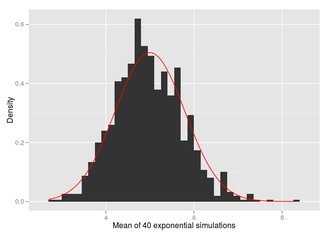

# Part 1: A Simulation Exercise

## Introduction

In the first part of the project we study the exponential distribution under 
the central limit theorem using R. The probability density function of the 
exponential distribution is given by
\begin{equation*}
f(x;\lambda) = \begin{cases}
\lambda e^{-\lambda x} & x \ge 0, \\
0 & x < 0.
\end{cases},
\end{equation*}
where $\lambda > 0$ is the rate parameter. The distribution mean is $1/\lambda$ 
and the standard deviation is also $1/\lambda$. Specifically, this report 
investigates the distribution of 1,000 observations of averages of 40 exponential 
simulations. The rate parameter $\lambda$ will be set to 0.2 for all of the 
simulations.

## Simulations

Before running the simulations, we set the random seed to a fixed number to make 
the results reproducible. Also, the R packages that will be used throughout 
the report are loaded into the interpreter.


```r
set.seed(12345)

library("ggplot2")
```

We must obtain a sample with 1,000 observations of the average of 40 simulations 
of the exponential distribution, which can be generated in R with the following 
code fragment.


```r
mean_sample <- replicate(1000, mean(rexp(40, rate = 0.2)))
```

After running this code, `mean_sample` contains a vector with 1,000 elements.
This vector constitutes the sample that will be studied in the remainder 
of the report.

## Sample Mean versus Theoretical Mean

The expected value of the sample mean of the averages of the simulations of the 
exponential distribution is the theoretical distribution mean---i.e. $1/\lambda$, 
in this case $1/0.2 = 5$. Therefore, if we calculate the sample mean of
`mean_sample` we must obtain a value close to 5.


```r
mean(mean_sample)
```

```
## [1] 4.971972
```

This fact is also illustrated in the following plot, which shows a histogram of 
`mean_sample` along with a vertical line for the theoretical mean. 
It confirms that the sample is centred around the theoretical mean.


```r
data <- data.frame(x = mean_sample)
ggplot(data, aes(x = x)) +
    geom_histogram(binwidth = 0.15) +
    geom_vline(xintercept = 5, colour = "red") +
    xlab("Mean of 40 exponential simulations") +
    ylab("Count")
```

 

## Sample Variance versus Theoretical Variance

The theoretical variance of the distribution of the mean of 40 exponential simulations
is $\sigma^2/n$, where $\sigma^2$ is the variance of the exponential distribution
$1/\lambda^2$ and $n$ is the sample size---i.e. in this case 
$\frac{1}{n \lambda^2} = \frac{1}{40 \cdot 0.2^2} = 0.625$. So, if we calculate
the sample variance of `mean_sample` we must obtain a value close to 0.625.


```r
var(mean_sample)
```

```
## [1] 0.5954369
```

Additionally, the following code fragment repeats 1,000 times the simulation 
of the sample mean of the averages of the exponential simulations to collect a 
sample of the distribution of the variance. The plot illustrates that the 
sample variance is centred around the theoretical variance of the 
distribution 0.625 represented by the vertical line.


```r
var_sample <- replicate(1000, var(replicate(1000, mean(rexp(40, rate = 0.2)))))

data <- data.frame(x = var_sample)
ggplot(data, aes(x = x)) +
    geom_histogram(binwidth = 0.005) +
    geom_vline(xintercept = 0.625, colour = "red") +
    xlab("Variance of the mean of 40 exponential simulations") +
    ylab("Count")
```

 

## Distribution

According to the central limit theorem, the distribution of the averages of the 
exponential simulations becomes normal as the sample size increases. The result 
is that the sample in `mean_sample` approximates $N(\mu,\sigma^2/n)$, where
$\mu$ and $\sigma^2$ are the mean and the variance of the exponential distribution,
respectively, and $n$ is the sample size---i.e. in this case $N(5,0.625)$.
The following plot illustrates this fact by showing the histogram of 
`mean_sample` along with the density function of a normal distribution 
with mean 5 and variance 0.625.


```r
data <- data.frame(x = mean_sample)

normal_data = data.frame(x = seq(min(mean_sample), max(mean_sample), length = 100))
normal_data$density = dnorm(normal_data$x, mean = 5, sd = sqrt(0.625))

ggplot(data, aes(x = x, y = ..density..)) +
    geom_histogram(binwidth = 0.15) +
    geom_line(aes(x = x, y = density), data = normal_data, colour = "red") +
    xlab("Mean of 40 exponential simulations") +
    ylab("Density")
```

 
