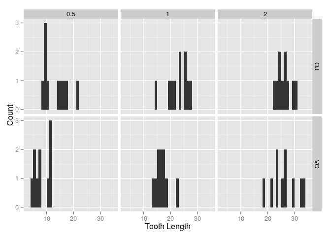

# Part 2: Basic Inferential Data Analysis

## Introduction

In the second part of the project we perform an analysis of the `ToothGrowth` 
data provided as part of the R `datasets` package. The dataset reports the 
results of a study of the effect of vitamin C on tooth growth in guinea pigs.
The length of the teeth was measured in 60 guinea pigs, corresponding to 
10 subjects for each combination of three dose levels of vitamin C 
(0.5, 1, and 2 mg) and two delivery methods (orange juice or ascorbic acid). 
The following references contain additional information about the dataset.

> Crampton, E. W. (1947) "The growth of the odontoblasts of the incisor 
> tooth as a criterion of the vitamin C intake of the guinea pig".
> The Journal of Nutrition, 33:5, 491-504.
> 
> C. I. Bliss (1952) "The Statistics of Bioassay". Academic Press.
> 
> McNeil, D. R. (1977) "Interactive Data Analysis". New York: Wiley.

## Loading the Required Packages

The following R packages are required to perform the analysis in this report.


```r
library("datasets")
library("dplyr", warn.conflicts = FALSE)
library("ggplot2")
```

## Exploratory Analysis

First, the dataset is loaded into R and the `str` function is used to obtain
some information about its structure.


```r
data(ToothGrowth)
ToothGrowth$dose <- factor(ToothGrowth$dose)
str(ToothGrowth)
```

```
## 'data.frame':	60 obs. of  3 variables:
##  $ len : num  4.2 11.5 7.3 5.8 6.4 10 11.2 11.2 5.2 7 ...
##  $ supp: Factor w/ 2 levels "OJ","VC": 2 2 2 2 2 2 2 2 2 2 ...
##  $ dose: Factor w/ 3 levels "0.5","1","2": 1 1 1 1 1 1 1 1 1 1 ...
```

The dataset contains 60 observations of three variables: `len` for the tooth length, 
`supp` for the delivery method (encoded as `"OJ"` and `"VC"` for orange juice and 
ascorbic acid, respectively), and `dose` for the dose level. The `dose` variable was 
originally represented as a numerical variable, but for the purpose of this 
analysis it is easier to treat it as a categorical variable with three levels 
and it was converted to factors.

In order to help us get a sense of the features in the data, the following code
builds a plot with a histogram of the tooth length for each combination of 
the values of the `supp` and `dose` variables.


```r
ggplot(ToothGrowth, aes(x = len)) +
    facet_grid(supp ~ dose) +
    geom_histogram(binwidth = 1) +
    labs(x = "Tooth Length", y = "Count")
```

 

The plot suggests that an increasing dose of vitamin C has a positive impact on 
tooth growth and that similar results are obtained with both delivery methods. 
The next section studies these hypotheses in more detail.

## Comparing Tooth Growth by Delivery Method and Dose Level

First we study the null hypothesis that both delivery methods produce similar results,
versus the alternative hypothesis that they give different results. We conduct a 
two-sided $t$-test assuming different variances.


```r
t.test(filter(ToothGrowth, supp == "OJ")$len,
       filter(ToothGrowth, supp == "VC")$len,
       alternative = "two.sided", var.equal = FALSE, 
       conf.level = 0.95)
```

```
## 
## 	Welch Two Sample t-test
## 
## data:  filter(ToothGrowth, supp == "OJ")$len and filter(ToothGrowth, supp == "VC")$len
## t = 1.9153, df = 55.309, p-value = 0.06063
## alternative hypothesis: true difference in means is not equal to 0
## 95 percent confidence interval:
##  -0.1710156  7.5710156
## sample estimates:
## mean of x mean of y 
##  20.66333  16.96333
```

According to the results, there is no statistical evidence at the 5% confidence 
level to support the alternative hypothesis that the two means are different. 
Therefore, we can conclude that the two delivery methods produce similar results.

Next, we study the hypothesis that an increasing dose of vitamin C accelerate 
tooth growth independently of the delivery method. We perform two
one-sided $t$-tests, one for the 1 mg dose versus the 0.5 mg dose and
another for the 2 mg dose versus the 1 mg dose. In both cases the alternative
hypothesis is that larger doses accelerate growth, according to the 
mean tooth length. The tests are conducted using the following R code.


```r
t.test(filter(ToothGrowth, dose == "1")$len,
       filter(ToothGrowth, dose == "0.5")$len,
       alternative = "greater", var.equal = FALSE, 
       conf.level = 0.95)
```

```
## 
## 	Welch Two Sample t-test
## 
## data:  filter(ToothGrowth, dose == "1")$len and filter(ToothGrowth, dose == "0.5")$len
## t = 6.4766, df = 37.986, p-value = 6.342e-08
## alternative hypothesis: true difference in means is greater than 0
## 95 percent confidence interval:
##  6.753323      Inf
## sample estimates:
## mean of x mean of y 
##    19.735    10.605
```

```r
t.test(filter(ToothGrowth, dose == "2")$len,
       filter(ToothGrowth, dose == "1")$len,
       alternative = "greater", var.equal = FALSE, 
       conf.level = 0.95)
```

```
## 
## 	Welch Two Sample t-test
## 
## data:  filter(ToothGrowth, dose == "2")$len and filter(ToothGrowth, dose == "1")$len
## t = 4.9005, df = 37.101, p-value = 9.532e-06
## alternative hypothesis: true difference in means is greater than 0
## 95 percent confidence interval:
##  4.17387     Inf
## sample estimates:
## mean of x mean of y 
##    26.100    19.735
```

In both cases the obtained p-value is less than 0.05, which means that the 
null hypothesis is rejected at the 5% significance level. Therefore, the 
evidence suggests that increasing dose levels accelerate tooth growth.

## Conclusions

Based on the results, we can conclude that that an increasing dose of vitamin C 
administered to guinea pigs increases the tooth growth. The analysis assumes 
through the use of the $t$-test that the tooth length is normally distributed. 
The data only partially supports this assumption, given that some of the 
histograms built during the exploratory analysis phase show right or 
left skewed distributions.
